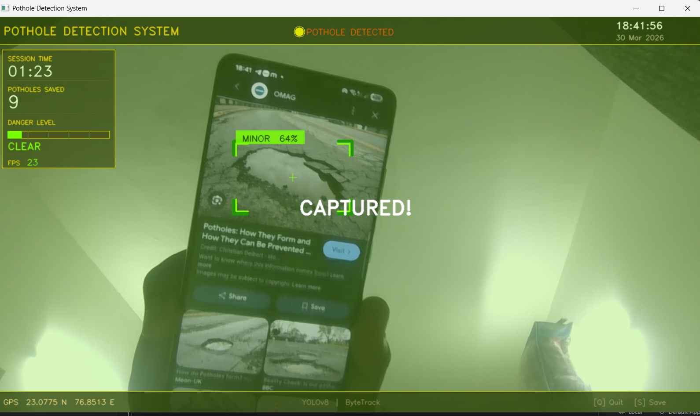

# 🚧 P.A.T.R.O.L
### Pothole Autonomous Tracking, Reporting and Logging
 
<p align="center">
  
  
  
  
  
</p>
 
> A real-time pothole detection and logging system using a live camera feed, YOLOv8s object detection, and ByteTrack multi-object tracking — with an on-screen HUD, audio alerts, auto-capture, GPS tagging, and CSV reporting.
 
---
 
## 📸 Interface Preview
 

```

```
 

 
---
 
## 🧠 Project Overview
 
P.A.T.R.O.L is an AI-powered road monitoring system designed to autonomously detect potholes in real-time using a webcam or dashcam feed. The system classifies detected potholes by severity, logs them with GPS coordinates and timestamps, and produces a structured CSV report for further analysis or reporting to authorities.
 
The project was developed as part of the **EPICS (Engineering Projects in Community Service)** initiative at **VIT Bhopal University**, aimed at addressing road safety through smart AI-based infrastructure monitoring.
 
---
 
## ✨ Key Features
 
| Feature | Description |
|---|---|
| 🎯 Real-time Detection | YOLOv8s model running live on webcam feed at configurable resolution |
| 🔁 Multi-Object Tracking | ByteTrack algorithm tracks individual potholes across frames |
| 🟥 Severity Classification | Classifies potholes as **MINOR**, **MODERATE**, or **SEVERE** based on confidence and bounding box area |
| 📊 Live HUD Dashboard | On-screen panel showing FPS, session time, danger level bar, saved count |
| 🔔 Proximity Audio Alerts | Dynamic beeper — pitch and frequency increase as danger level rises |
| 📷 Auto-Capture | Automatically saves pothole frames (with 3-second cooldown) to `pothole_captures/` |
| 🗂️ CSV Logging | Every captured pothole logged with timestamp, GPS, confidence, and severity |
| 📍 GPS Tagging | Coordinates stamped on every capture and log entry |
| ⌨️ Manual Save | Press `S` to manually save a frame during detection |
| 🎨 Custom UI Overlays | Corner brackets, label pills, crosshairs, danger bar, flash animation |
 
---
 
## 🗂️ Project Structure
 
```
PATROL-Pothole-Detection/
│
├── final_project.py          # Main detection + HUD system (run this)
├── train.py                  # YOLOv8s training script
├── data.yaml                 # Dataset configuration for training
│
├── pothole_report.csv        # Auto-generated detection log
├── pothole_report.xlsx       # Excel version of the report
│
├── pothole_captures/         # Auto-saved pothole images
│   └── pothole_YYYY-MM-DD_HH-MM-SS.jpg
│
├── runs/                     # YOLOv8 training output (weights, graphs)
├── train/                    # Training dataset (images + labels)
├── valid/                    # Validation dataset
├── test/                     # Test dataset
├── data/                     # Additional data files
│
├── best.pt                   # Best trained model weights (not uploaded to Git)
├── yolov8s.pt                # Base YOLOv8s pretrained weights (not uploaded)
│
├── README.dataset            # Dataset source info (Roboflow)
└── README.roboflow           # Roboflow export metadata
```
 
---
 
## 🚀 Getting Started
 
### Prerequisites
 
```bash
pip install ultralytics opencv-python numpy
```
 
> **Note:** `winsound` is a built-in Windows library — no install needed. On Linux/Mac, comment out the beeper section in `final_project.py`.
 
### Running the Detection System
 
1. Place your trained `best.pt` model in the project root.
2. Connect a webcam.
3. Run:
 
```bash
python final_project.py
```
 
**Controls:**
- `Q` — Quit the program
- `S` — Manually save current frame (only works when a pothole is detected)
 
---
 
## 📄 File Descriptions
 
### `final_project.py` — Main Detection System
 
The core of P.A.T.R.O.L. This script handles everything from live inference to the full on-screen HUD and automated logging.
 
#### 🔧 Configuration Block
```python
model_path      = 'best.pt'         # Path to trained YOLO weights
save_folder     = 'pothole_captures' # Folder to store captured images
csv_file        = 'pothole_report.csv'
cooldown_seconds = 3                 # Minimum gap between auto-saves
```
 
#### 🧩 Key Components
 
**1. YOLOv8 + ByteTrack Inference**
```python
results = model.track(img, augment=True, stream=True, verbose=False,
                      conf=0.25, iou=0.45, tracker="bytetrack.yaml",
                      persist=True)
```
- Uses `.track()` instead of `.predict()` for persistent multi-object tracking across frames
- `augment=True` enables test-time augmentation for better recall
- `persist=True` maintains track IDs between frames
 
**2. Severity Classification**
 
Each detected pothole is assigned a severity level based on two factors:
- **Confidence score** from the YOLO model
- **Area ratio** — how much of the screen the bounding box covers
 
```python
def get_severity(conf, area_ratio):
    if area_ratio > 0.08 or conf > 0.85:
        return "SEVERE",   COLOR_RED,    3
    elif area_ratio > 0.03 or conf > 0.65:
        return "MODERATE", COLOR_YELLOW, 2
    else:
        return "MINOR",    COLOR_GREEN,  1
```
 
**3. Danger Level System**
 
A smooth, real-time danger metric is computed as:
- `current_danger_level` = largest bounding box area / total screen area
- Smoothed using a rolling average over the last 10 frames
- Decays at 0.02/frame when no pothole is detected
- Drives the on-screen danger bar color (Green → Yellow → Red)
 
**4. Proximity Beeper (threaded)**
 
Runs on a separate daemon thread. As danger level increases:
- Beep **pitch** scales from 500 Hz → 3000 Hz
- Beep **interval** shrinks from 1.0s → 0.05s (rapid beeping at high danger)
 
**5. HUD Layout**
 
| Region | Content |
|---|---|
| Top Bar | System title, live clock, date, detection status indicator |
| Left Panel | Session timer, potholes saved count, danger level bar, FPS |
| Bottom Bar | GPS coordinates, model info, keyboard shortcut hints |
| Detection Overlay | Corner brackets, label pill (severity + confidence %), center crosshair |
 
**6. Auto-Save & CSV Logging**
 
When a pothole is detected and cooldown has elapsed:
- Frame saved as `pothole_YYYY-MM-DD_HH-MM-SS.jpg` in `pothole_captures/`
- CSV row appended: `[Timestamp, Latitude, Longitude, Confidence, Severity, Image Name]`
- Screen flashes green with "CAPTURED!" overlay
 
**7. GPS Module**
```python
def get_live_coordinates():
    return "23.0775 N", "76.8513 E"
```
> Currently returns fixed coordinates (VIT Bhopal). Can be replaced with live GPS hardware input (e.g., NMEA via serial port).
 
---
 
### `train.py` — Model Training Script
 
Used to fine-tune a YOLOv8s model on the custom pothole dataset.
 
```python
from ultralytics import YOLO
 
if __name__ == '__main__':
    model = YOLO('yolov8s.pt')
 
    results = model.train(
        data='data.yaml',
        epochs=100,
        imgsz=640,
        batch=4,
        workers=4,
        device=0,
        patience=15,
        cos_lr=True,
        mixup=0.1,
        close_mosaic=10,
    )
```
 
#### Training Parameters Explained
 
| Parameter | Value | Purpose |
|---|---|---|
| `epochs` | 100 | Full training cycles over the dataset |
| `imgsz` | 640 | Input image resolution (standard YOLO size) |
| `batch` | 4 | Small batch for limited VRAM systems |
| `device` | 0 | Use GPU (CUDA device 0) |
| `patience` | 15 | Early stop if no improvement for 15 epochs |
| `cos_lr` | True | Cosine LR schedule for smoother convergence |
| `mixup` | 0.1 | Light mixup augmentation to reduce overfitting |
| `close_mosaic` | 10 | Disable mosaic augmentation in final 10 epochs for stability |
 
Training outputs (weights, metrics, confusion matrix, PR curves) are saved to `runs/detect/train/`.
 
---
 
## 📊 Dataset
 
The model was trained on a **Mega Dataset** compiled from multiple sources, curated and exported via Roboflow.
 
- **Total Images:** 16,302
- **Classes:** `pothole`
- **Split:** Train / Valid / Test
- **Annotation Format:** YOLOv8 (txt labels)
- **Source:** See `README.dataset` and `README.roboflow` for full attribution
 
---
 
## 📈 Output: CSV Report
 
Every auto-saved detection is logged in `pothole_report.csv`:
 
```
Timestamp,           Latitude,  Longitude, Confidence, Severity,  Image Name
2026-03-27_14-32-11, 23.0775 N, 76.8513 E, 0.87,       SEVERE,    pothole_2026-03-27_14-32-11.jpg
2026-03-27_14-33-05, 23.0775 N, 76.8513 E, 0.71,       MODERATE,  pothole_2026-03-27_14-33-05.jpg
```
 
An Excel version (`pothole_report.xlsx`) is also maintained for easy review.
 
---
 
## 🛠️ Tech Stack
 
| Component | Technology |
|---|---|
| Object Detection | YOLOv8s (Ultralytics) |
| Multi-Object Tracking | ByteTrack |
| Computer Vision | OpenCV 4.x |
| Deep Learning | PyTorch (via Ultralytics) |
| Data Logging | Python CSV / openpyxl |
| Audio Alerts | winsound (Windows) |
| UI Rendering | OpenCV drawing API |
| Language | Python 3.9+ |
 

---
 
## 🔮 Future Scope
 
- [ ] Live GPS integration via serial NMEA module
- [ ] Mobile deployment (Android via TFLite + INT8 quantization)
- [ ] Web dashboard for real-time fleet monitoring
- [ ] Pothole severity heatmap generation
- [ ] Integration with municipal reporting APIs
 

